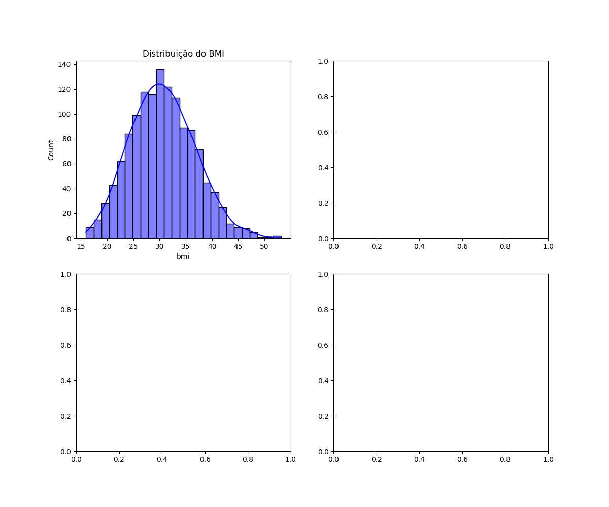
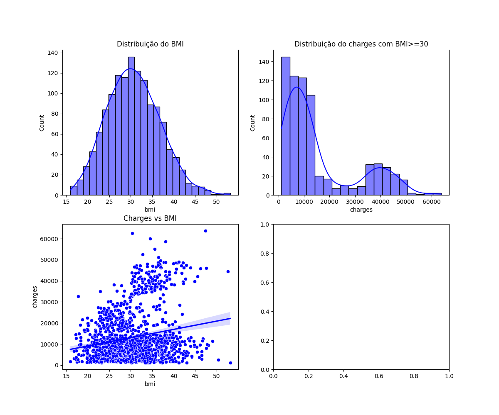

# 🧠 Insurance Analysis Project

## 🎯 Objetivo

Este projeto tem como objetivo explorar e analisar dados relacionados a seguros de saúde, com foco em entender os fatores que influenciam o valor das cobranças (`charges`) aplicadas aos pacientes. A análise busca identificar padrões relevantes que possam orientar decisões estratégicas, segmentações e ações de precificação.

---

## 🧰 Metodologia

- **Exploração de dados**: análise descritiva das variáveis principais (idade, BMI, número de filhos, tabagismo, região).
- **Segmentação de grupos**: criação de faixas de BMI para comparação entre pacientes com sobrepeso e sem.
- **Visualizações**: uso de histogramas, boxplots e gráficos de dispersão para entender distribuições e relações.
- **Testes estatísticos**:
  - Shapiro-Wilk para normalidade
  - Levene para variância
  - Mann-Whitney para hipótese entre grupos não normais

---

## 📊 Principais Insights

Ao explorar os dados, identificamos uma diferença marcante entre os grupos de pacientes com **BMI ≥ 30** e **BMI < 30**. O grupo com índice de massa corporal mais elevado apresenta valores de cobrança significativamente maiores, evidenciado tanto pela **média** (sensível a outliers) quanto pela **mediana** (mais robusta e representativa do centro da distribuição).

Essa diferença inicial nos levou a investigar a **dispersão dos dados**, e de fato observamos uma variabilidade considerável dentro de cada grupo. Além disso, os testes de normalidade indicaram que os dados **não seguem distribuição normal**, o que nos direcionou para o uso de **testes não paramétricos**.

Aplicando o **teste de Mann-Whitney**, conseguimos confirmar que a diferença entre os grupos é **estatisticamente significativa**, ou seja, **não é fruto do acaso**. Com esse resultado, temos respaldo para tratar os dois grupos de forma distinta e investigar estratégias específicas para entender os fatores que influenciam maiores cobranças.

---

## 📈 Visualizações

### Distribuição do BMI

### Distribuição de Charges com BMI ≥ 30

### Charges vs BMI (com regressão)

### Distribuição de Charges com BMI < 30

### Boxplot de Charges por Faixa de BMI

> Os gráficos acima foram gerados no notebook `insurance.ipynb` e salvos na pasta `images/`.

---

## 🔮 Próximos Passos

- Criar modelos preditivos para estimar `charges` com base em variáveis como BMI, idade e tabagismo.
- Investigar o impacto do tabagismo e da região geográfica nas cobranças.
- Desenvolver dashboards interativos com Streamlit para visualização dinâmica.
- Aplicar técnicas de clusterização para identificar perfis de pacientes.

---

## 📁 Estrutura do Projeto

